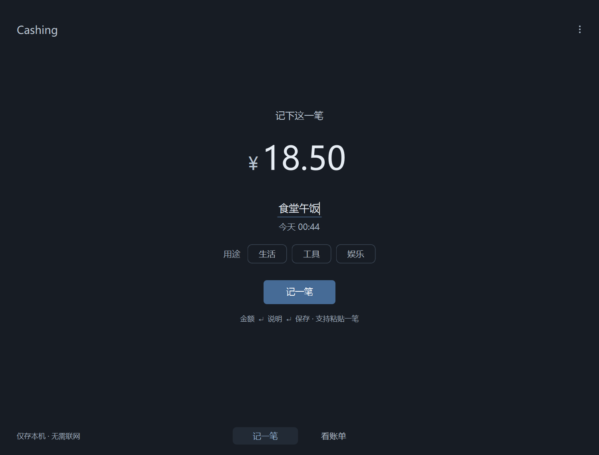
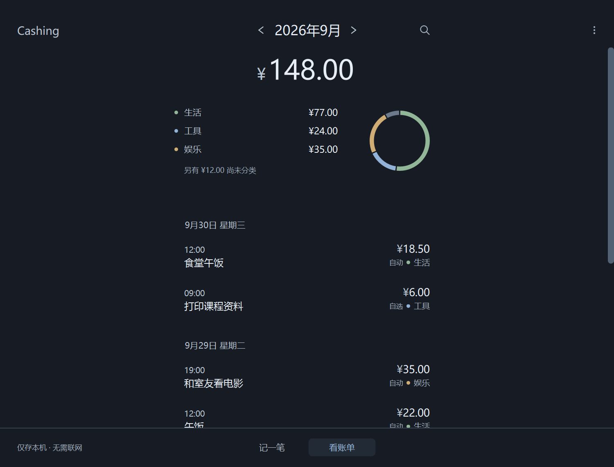

[English](README.md) | **简体中文**

<p align="center">
  
</p>

# Cashing

**记一笔，看这个月。**

Cashing 是一款简洁的 Windows 本地记账软件，适合记录午饭、打印、订阅和日常开销。
无需注册，账单保存在自己的电脑；没有广告、遥测或云端分类。

**[下载 1.2.0 Windows 便携版](https://github.com/Lorentz-Caldfilis/Cashing/releases/tag/v1.2.0)** · [使用指南](docs/USER_GUIDE.md) · [反馈问题](https://github.com/Lorentz-Caldfilis/Cashing/issues)

## 功能

- **快速记账**：金额、说明、回车保存，也支持粘贴 `18.5 午饭`。
- **简单分类**：生活、工具、娱乐可直接选择；未选时本地判断，支持纠正与个人习惯学习。
- **查看消费**：按月汇总、类别占比、按天明细和历史搜索。
- **放心修改**：记录可编辑、删除和撤销，未完成输入会保存为草稿。
- **本地备份**：从菜单备份账本，数据与程序目录分开。
- **跟随系统**：浅色与深色随系统设置变化。

| 记一笔 | 看账单 |
| --- | --- |
|  |  |

截图使用演示数据。界面颜色跟随系统设置。
软件界面和详细指南目前使用简体中文。

## 开始使用

1. 打开 [1.2.0 下载页面](https://github.com/Lorentz-Caldfilis/Cashing/releases/tag/v1.2.0)，下载 `Cashing-v1.2.0-windows.zip`。
2. 完整解压 ZIP，双击其中的 `Cashing/Cashing.exe`。保留整个文件夹及 `_internal`，无需安装 Python。
3. 输入金额，按 Enter，填写说明，再按 Enter 保存。说明可留空，用途也不必选择。

点击底部“看账单”回看消费，点击记录修改；右上角菜单提供数据目录、备份和关于。
更新前先备份并关闭程序，再将新版解压到新的文件夹。

Windows 数据默认保存在 `%LOCALAPPDATA%\Cashing`，替换程序不会删除账单。
账本和备份未加密；请自行定期备份。完整操作、快捷键及恢复步骤见 [使用指南](docs/USER_GUIDE.md)。

## 使用范围

当前提供 **1.2.0 预发行版，Windows x64**。程序尚未数字签名，下载页面附有 SHA-256 校验文件。
只记录人民币消费，暂不支持收入、预算、多账户、云同步或账单导入导出。
自动分类可能无法判断用途，也可能判断错误；可以手动纠正，不影响消费总额。
分类准确性和界面操作仍在持续改进。

## 从源码运行

使用 Python 3.14 x64，在仓库根目录执行以下 PowerShell 命令：

```powershell
python -m venv .venv
.\.venv\Scripts\python.exe -m pip install -r requirements.txt
.\.venv\Scripts\python.exe main.py
```

安装依赖需要联网，日常记账不需要联网。开发、测试和 Windows 打包见 [开发指南](docs/development/DEVELOPER_GUIDE.md)。

## 参与与许可

欢迎提交问题、建议或 Pull Request；请用虚构的消费例子复现问题，保护自己的账本和日志。
开始修改前请阅读 [贡献指南](CONTRIBUTING.md)与 [产品设计原则](docs/PRODUCT.md)。安全问题请按 [安全说明](SECURITY.md)私密报告。

Cashing 采用 [MIT 许可证](LICENSE)，© 2026 Lorentz-Caldfilis。
可免费使用、修改和再分发，须保留版权与许可声明。第三方组件的许可见 [依赖说明](docs/THIRD_PARTY.md)。
