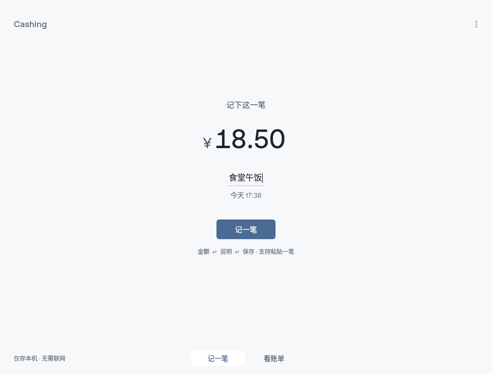
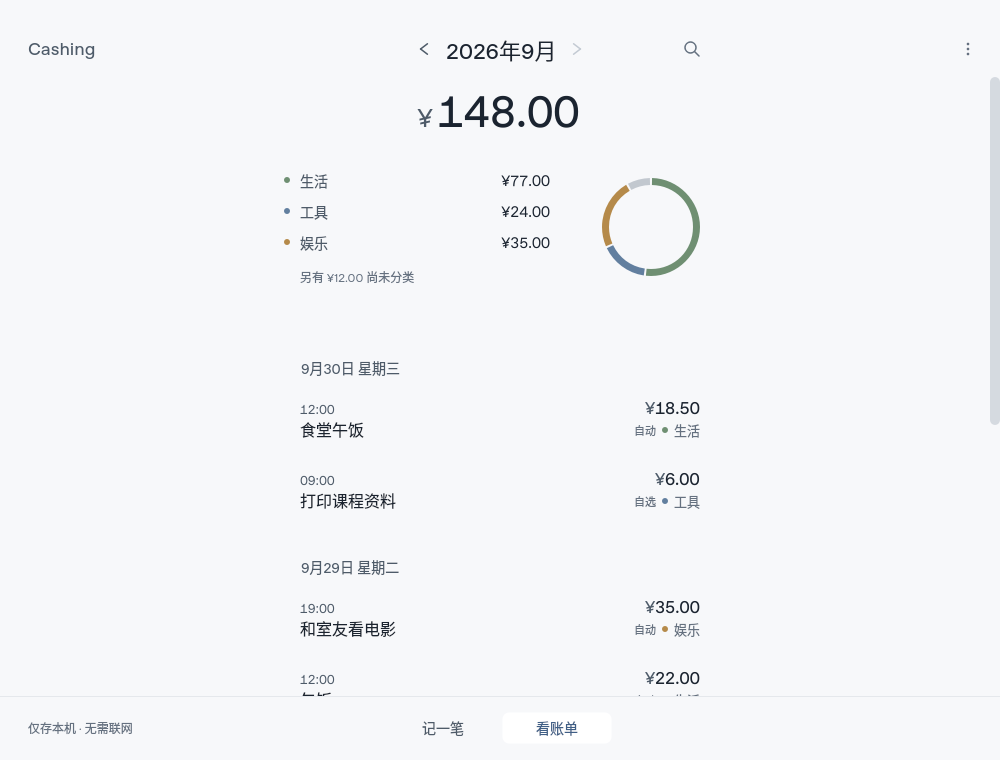
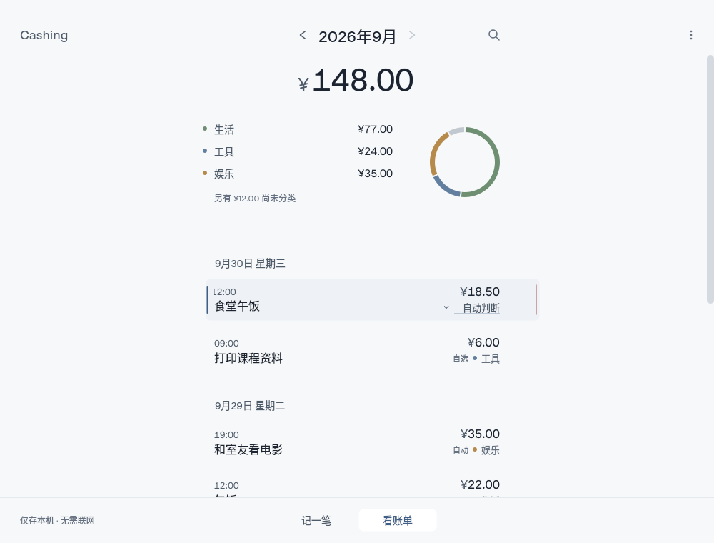
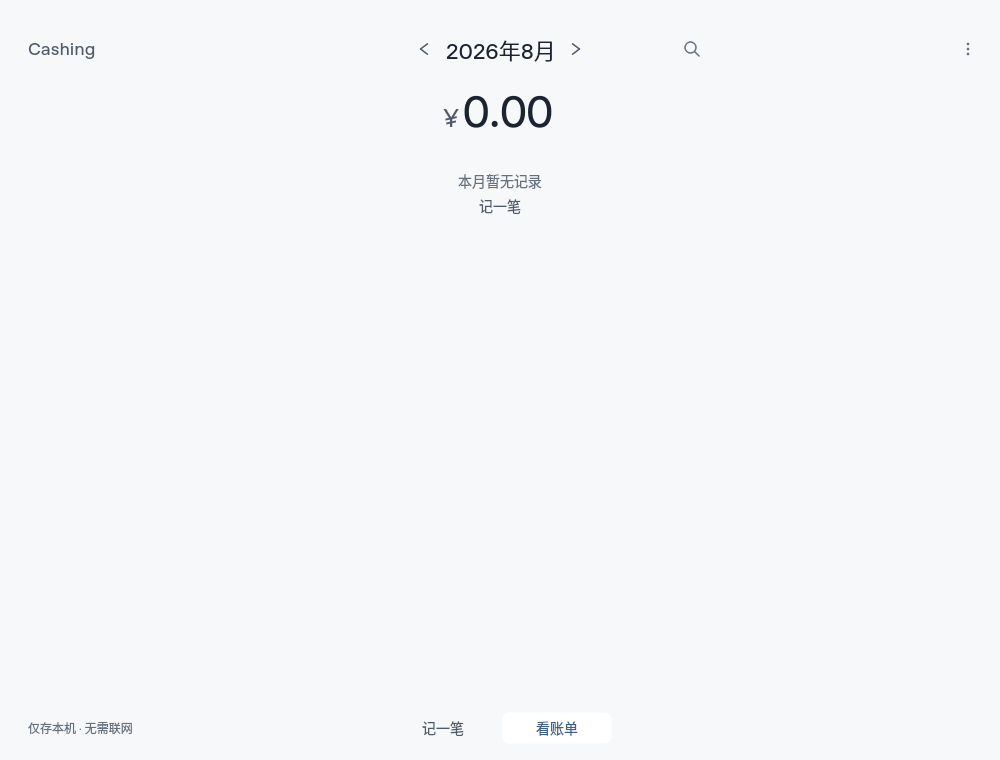

# 第二阶段：分类与首次使用（预先验收标准）

2026-09-30；起点 `d9031ce`，同一分支与 PR #2。截止 23:40:48 UTC，22:40:48 后仅验收。
第一阶段独立审查由父任务安排；阻塞反馈优先于本阶段扩展。

## 固定验收标准（实现前记录）

1. 固定 DEV 场景涵盖食堂、咖啡、打印、教材、交通、宿舍购物、平台购物、同商户不同用途。
   冷启动仅接受明确证据；未知、歧义和冲突可以保持未判断，不能以覆盖率换取误判。
2. 同样说明的纠正影响未来及历史派生类别；“自动判断”、撤销和删除必须正确撤回学习。
   同商户两种明确用途能分别学习，不能把商户名直接当作所有用途的真值。
3. 算法/词表如有改动，固定 HOLDOUT 不参与调参；报告改前/改后类别，不能声称真实学生效果。
4. 首次启动仍直接聚焦金额，无向导、账号或新增必填。空账单提供可理解的下一步。
5. 未判断的记录能发现分类入口；编辑时能分清自动判断与自己指定，不打开编辑就产生训练样本。
6. 所有新路径保留键盘操作、原地纠错、合成数据、整数分与本地持久化；低负担优先于新入口数量。
7. 每个独立批次给出针对性测试、回退办法；阶段末一次完整回归及实际 GUI 截图。

## 决策约束

先运行场景再选择改动，不预设增加校园词库、预算、商户系统或云模型。
优先修复可复现的错误/理解障碍；没有明确收益就保留现有判断。

## 批次 A：平台词不否定明确商品

基线 DEV 24 条：20 条符合预期、明确用途解决 8/12、错误决定 0；固定 HOLDOUT 12 条：
7 条符合预期、明确用途解决 1/6、错误决定 0。10 条学习/撤回流程全部通过。

仅将“淘宝、京东、拼多多、网购”从歧义词移到中性词：平台本身没有类别证据，
但也不应挡住“教材、洗衣液、桌游”等商品证据。没有新增校园词、阈值或依赖。
改后 DEV 24/24、明确用途 12/12；HOLDOUT 11/12、明确用途 5/6；两组错误决定仍为 0。
“图书馆复印讲义”仍因“图书”的歧义保守不判断；不根据本轮留出结果继续调词。
HOLDOUT 在实现前固定，非真实/外部盲测；以后重复使用只能称回归样本。

针对性测试：classification + student_scenarios 42 项通过（含既有合成学习基准门槛）。
报告：[改前](evidence/phase2-20260930/classification-before.json)、[改后](evidence/phase2-20260930/classification-after.json)。
回退：revert 本批提交；自动类别会按旧词表重新派生，不影响存储事实或个人类别标签。

## 独立审查反馈：已实际复现并修复

父任务对 d9031ce 的源码审查指出 P1/P2；审查方未运行环境，因此不记为独立执行验收。
本地新增两个 GUI 回归后先运行，均实际失败：
- P1：自动“午饭”仅改描述为“电影票”后离开，数据库 category_by_user 意外变成 1。
- P2：显式“生活”→自动→撤销后，数据库来源为 1，而行缓存来源仍为 False。

修复：只有分类控件的显式交互可提交类别；说明改变后的派生类别以屏蔽信号方式同步控件。
HistoryList 状态键包含 category_by_user，避免同显示值但来源不同的状态被缓存忽略。
额外修复：非法编辑阻止撤销时通知重新保留同一撤销回执，取消非法输入后可重试。
覆盖正反两种来源切换及第二次操作。Review/Edit 定向回归 40 项通过；4 条新增审查回归另在
真实 X11/xcb Qt 窗口执行，结果见后续执行记录。
回退：revert 本修复提交会重新引入这两项学习可信度缺陷，不建议独立回退。

## 批次 B：分类来源、空态与小窗口

“自动 / 自选”来源及“暂未判断”入口直接可见并加入辅助技术名称；自动记录在编辑框选中
“自动判断”。仅打开或退出编辑不产生标签。空账单可直接回到录入。
Tab/Shift+Tab 限定当前空间，覆盖前后各 25 次遍历；不会落入仍被 Qt 视为可见的滑出页面。

实际 X11 680×440 长错误截图复现数字被挤压、详情截断。将录入内容放入带上下安全边距的
滚动区，短窗口隐藏非必要提示；错误详情使用可滚动、可复制的只读区域并自动滚入视口。
不截断错误字符串，不清空输入。最终截图已目视核对；截图脚本等待布局稳定后再抓取金额。
定向验证：Review/Edit/Spaces 53 项、Capture/Spaces 37 项通过；错误自动可见另有专项回归。
审查新增 4 条回归在 X11 执行：4 passed（3.47 秒）。
回退：revert 本批 UI 提交；不影响数据或已修复的分类交互意图/来源缓存逻辑。

## 阶段最终验收与交付

应用源码验证点 `73be09e`。第二阶段完整回归 **279 passed，14.17 秒**，`-W error`；
没有在每次小改动后重复无关全量测试。真实 Linux X11/xcb 进程的 100%、125%、150%、200%
及 100% 重启共 **5/5 PASS**，包含单笔粘贴、草稿、分类重置/撤销、备份及原有交互。

- [完整测试原始输出](evidence/phase2-20260930/pytest.txt)
- [GUI 进程原始报告](evidence/phase2-20260930/desktop-verification.json)
- [审查与交互回归的 X11 输出](evidence/phase2-20260930/x11-review-regressions.txt)：最终 UI 上 7 passed，3.66 秒，覆盖审查两项、反向来源、重试、Tab、可见来源和长错误。

| 提交 | 范围 | 回退方法 |
|---|---|---|
| `82875b1` | 预先记录验收标准 | 仅文档，建议保留 |
| `2eac0de` | 四个平台词的证据处理及固定合成场景 | revert，已有事实与标签不变 |
| `8b10662` | 已复现 P1/P2、非法编辑后的撤销重试 | revert 会重引缺陷，不建议单独回退 |
| `73be09e` | 分类来源、空态、Tab 边界与长错误恢复 | revert，恢复此前 UI，数据不变 |

所有变更仍在 `codex/student-edition-20260930` / PR #2。schema v3、许可证、main 基线不变。
独立审查反馈来自源码追踪，本报告的运行结果由作者执行；尚待父任务复核修复。
Windows IME、触控板、跨屏、原生 Windows/冻结包、物理断网等未测边界继续有效。
固定语料规模小，咖啡等用途仍依赖个人纠正；不把本轮结果写成真实长期用户准确率。

## 最终截图（X11，合成数据）

长错误截图已滚动到详情；金额保留在上方，可滚回查看，不是被裁切或清空。
