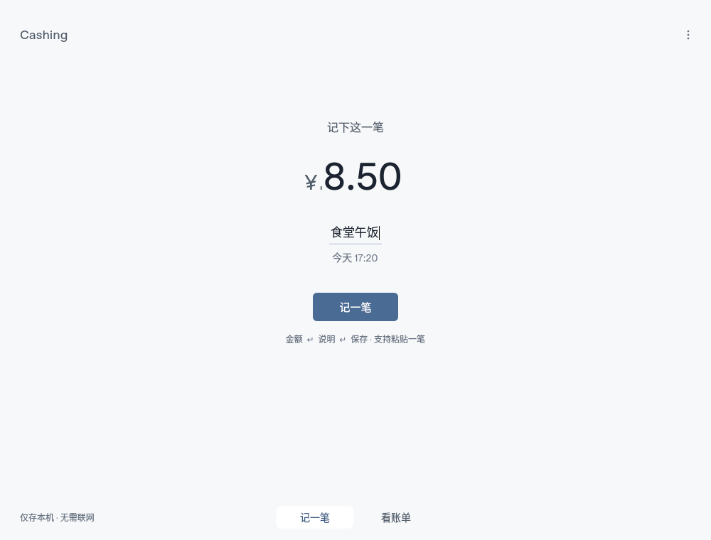
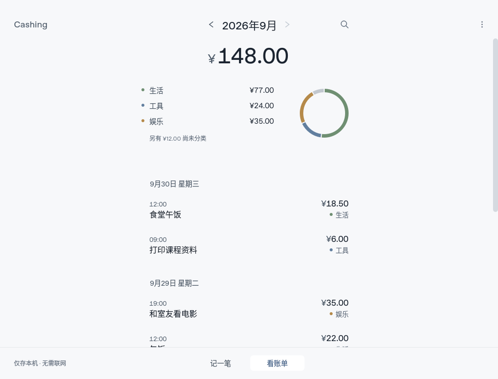
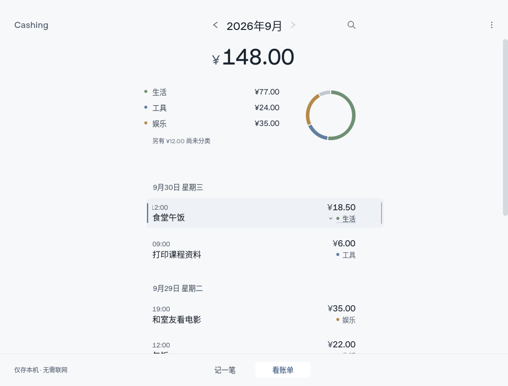
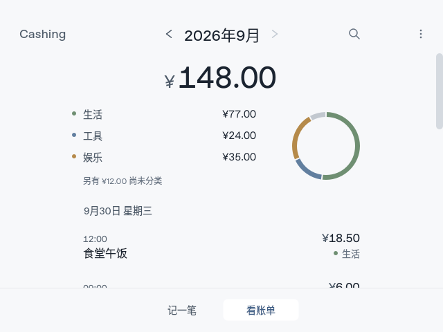

# Student edition 验收矩阵

日期：2026-09-30。应用验证源码提交：`cba7cc1`（基线 `ebd0c8b`）。后续证据/文档提交不改变应用行为。
环境：Debian 13、Python 3.12.14、PySide6/Qt 6.11.2。Xorg dummy 1440×1000 + Xfwm4，Qt xcb。
这是 Linux 虚拟显示环境，**不是 Windows 实机**。测试只使用 `work/` 下合成数据。

| 检查 | 实际结果 | 证据/边界 |
|---|---|---|
| 基线完整测试 | 237 passed，12.77s | `-W error`，Linux/offscreen |
| 最终完整测试 | 268 passed，12.83s | [原始输出](evidence/student-20260930/pytest.txt) |
| 金额、schema、迁移、搜索、分类、原有 GUI 回归 | 通过 | 包含在完整测试中；金额始终为整数分 |
| 原子草稿失败、旧文件保留、临时文件清理 | 通过 | `test_draft.py` 故障注入；未模拟真实断电 |
| 输入期间保存、撤销保留下一笔、关闭失败保留窗口 | 通过 | `test_ui_capture.py` |
| 分类重置/撤销、相同类别确认、拒绝覆盖后续编辑 | 通过 | `test_ledger.py`、`test_ui_review.py` |
| 备份读取一致、拒绝覆盖、失败清理、未知库保护 | 通过 | `test_backup.py`，真实 SQLite + 合成数据 |
| 单笔粘贴、全角数字、拒绝多笔/外币/截断/覆盖说明 | 通过 | `test_quick_entry.py`、`test_ui_capture.py` |
| 具名导航键盘操作、长通知、紧凑窗口、非法编辑关闭 | 通过 | Qt 自动交互 |
| 独立 GUI 进程：100/125/150/200% + 100% 重启 | 5/5 PASS | [原始 JSON](evidence/student-20260930/desktop-verification.json)，`native_windows=false` |
| 新流程实际 GUI：粘贴→自动草稿、恢复自动类别→键盘撤销、运行中备份 | 首次与重启均 PASS | [首次](evidence/student-20260930/newflows-first.json) / [重启](evidence/student-20260930/newflows-restart.json)，合成数据 |
| Python 依赖一致性 | `No broken requirements found` | `python -m pip check`；未新增依赖 |
| 运行时离线 | Python socket 调用被阻断下流程通过 | 未进行物理断网；不是操作系统网络审计 |
| 真实 Windows / 冻结 EXE / 解压发行包 | **未测** | 本环境不能生成或验证 Windows EXE |
| Windows IME、物理触控板、跨屏/DPI、干净机器 | **未测** | 合成按键与缩放不能替代真实设备 |
| 长期多月真实习惯学习、极大账本、多窗口冲突 | **未测** | 本轮未调词库/算法，不重新宣传历史合成精度 |

## 重现

```bash
.venv/bin/python -m pytest -q -W error --basetemp work/pytest-student-check
DISPLAY=:99 .venv/bin/python scripts/verify_desktop.py --platform xcb --label student-check-unique
DISPLAY=:99 QT_QPA_PLATFORM=xcb .venv/bin/python scripts/preview_student.py --label student-preview-unique
```

X11 命令要求已有可用显示和窗口管理器。没有显示时可用 `--platform offscreen`，但应另标为 offscreen。
每次完整验收使用新 `--label`；目录已存在时拒绝复用。脚本会在同一专用目录内按计划进行一次重启。
Windows 使用 `.venv\Scripts\python.exe`，`verify_desktop.py --platform windows`；冻结版继续用
README 中的 `verify_release.py --phase frozen`，本轮没有运行它。

## 截图（全部为合成消费）






## 验收过程中发现的环境和应用问题

- 最初 Linux smoke 未设置隔离 LOCALAPPDATA，启动保护拒绝；未触及用户数据。
- 原 smoke 强制 Windows 平台，已改为明确记录平台，Windows 上仍要求原生 windows 后端。
- 首次 X11 没有窗口管理器，焦点检查失败；配置隔离 Xfwm4 后通过。
- 截图发现小窗口首条说明被留白挤出，`cba7cc1` 收紧短窗口间距并补回归测试。
- 旧测试断言 Utility 恰好两个条目，已随新增备份入口更新为三个；未删除原有功能断言。

没有隐藏失败结果或将它们算作通过。早期环境失败报告保留在本地 `work/student-*`，最终通过证据归档于本目录。
